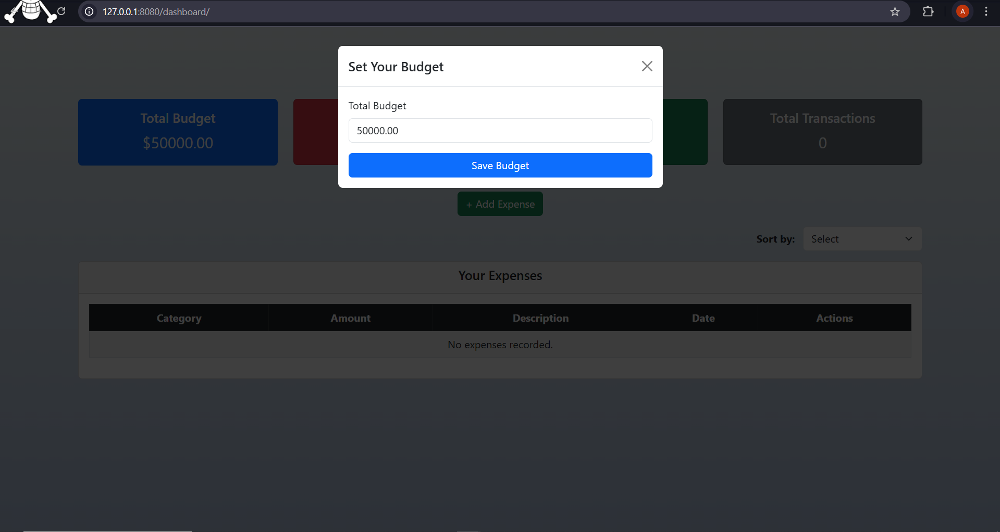

# Django Expense Tracker

## Overview
The Django Expense Tracker is a web-based financial management tool that helps users track their expenses, set budgets, and view spending insights. It allows users to create, update, and delete expenses, categorize transactions, and visualize financial summaries.

## Features
-  User Authentication: Secure login and registration system.
-  Expense Statistics: Total Budget, Budget Spent, Budget Left, and Total Transactions displayed.
-  Expense Management: Add, edit, and delete expenses.
-  Budget Tracking: Set and manage your total budget.
-  Sorting & Filtering: Sort expenses by date or category.
-  Modern UI: Responsive and user-friendly Bootstrap-based design.
-  Budget setting modal
-  Confirmation modal for deleting expenses

## Screenshots
### Login Page


### Register Page


### Dashboard View


### Set Budget Modal


### Add Expense Modal


### Edit Expense Modal


### Delete Expense Modal


## Installation Guide
### Prerequisites
Make sure you have the following installed:
- Python 3.x
- Pipenv (for managing virtual environments)
- Django (installed via Pipfile dependencies)

### Setup Instructions
1. Clone the Repository
   ```sh
   git clone https://github.com/Oluwaferanmiii/django-expense-tracker.git
   cd django-expense-tracker
   ```
2. Install Dependencies
    
    Since the project uses Pipenv, install dependencies by running:
    ```sh
    pipenv install
    ```
3. Activate Virtual Environment
   ```sh
   pipenv shell
   ```
4. Apply Migrations
   ```sh
   python manage.py migrate
   ```
5. Create a Superuser (Optional)
   ```sh
   python manage.py createsuperuser
   ```
   Follow the prompts to create an admin user.
6. Run the server
   ```sh
   python manage.py runserver
   ```
   Open your browser and visit http://127.0.0.1:8000/

   if another web app is using the port 8000

   try:
   ```sh
   python manage.py runserver 8080
   ```
   Open your browser and visit http://127.0.0.1:8080/

## Usage
- Register/Login to access the tracker.
- Set your budget before adding expenses by clicking on total budget.
- Add expenses with category, amount, description, and date.
- Edit or delete expenses as needed.
- Sort expenses by category or date.

## Future Improvements
### 1. Budget Breakdown & Pie Chart 📊
   - Display spending by category using a pie chart.
   - Users can see where most of their money is going.
### 2. Low Budget Warnings ⚠️
   - Notify users when the budget left is below 10%.
   - Change budget left box color to red if they exceed their budget.
### 3. Export Expenses 📜
   - Users can download CSV/PDF reports of their expenses.
   - Helps with external budgeting tools.
### 4. User Profile & Currency Settings 🌍
   - Allow users to set preferred currency (USD, EUR, INR, etc.).
   - Store currency settings in the UserProfile model.

## Contributing
If you would like to contribute, feel free to fork the repository and submit a pull request!

## License
This project is licensed under the MIT License.