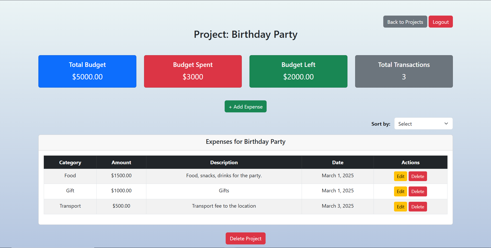

# Django Expense Tracker

---

## Overview
The Django Expense Tracker is a web-based financial management tool that helps users **track expenses for multiple projects**. Users can create different projects (e.g., "Birthday Party", "School Expenses") and manage expenses separately for each. Every project has its **own budget, transactions, and financial summary**.

---

## Features
- **User Authentication:** Secure login and registration system.
- **Multiple Projects Support:** Users can create and manage multiple projects, each with a unique budget.
- **Project-Based Expense Tracking:** Expenses are linked to specific projects, keeping finances separate.
- **Expense Management:** Add, edit, and delete expenses for each project.
- **Expense Statistics:** Total Budget, Budget Spent, Budget Left, and Total Transactions displayed for each project.
- **Sorting & Filtering:** Sort expenses by date or category.
- **Modern UI:** Responsive and user-friendly Bootstrap-based design.
- **Confirmation Modal:** Secure confirmation before deleting expenses.

---

## Screenshots
### Login Page


### Register Page


### Project View


### Dashboard View


### Add Expense Modal


### Edit Expense Modal


### Delete Expense Modal


---

## Installation Guide
### Prerequisites
Make sure you have the following installed:
- Python 3.x
- Pipenv (for managing virtual environments)
- Django (installed via Pipfile dependencies)

---

### Setup Instructions
1. Clone the Repository
   ```sh
   git clone https://github.com/Oluwaferanmiii/django-expense-tracker.git
   cd django-expense-tracker
   ```
2. Install Dependencies
    
    Since the project uses Pipenv, install dependencies by running:
    ```sh
    pipenv install
    ```
3. Activate Virtual Environment
   ```sh
   pipenv shell
   ```
4. Apply Migrations
   ```sh
   python manage.py migrate
   ```
5. Create a Superuser (Optional)
   ```sh
   python manage.py createsuperuser
   ```
   Follow the prompts to create an admin user.
6. Run the server
   ```sh
   python manage.py runserver
   ```
   Open your browser and visit http://127.0.0.1:8000/

   if another web app is using the port 8000, try:
   ```sh
   python manage.py runserver 8080
   ```
   Open your browser and visit http://127.0.0.1:8080/

---

## Usage
- Register/Login to access the tracker.
- **Create a new project** (each project has its own budget and expense database).
- Open a project to **add, edit, or delete expenses**.
- Track project-specific **total budget, spending, and remaining balance**.
- Switch between different projects from the **"My Projects" page**.

---

## Future Improvements
### 1. Budget Breakdown & Pie Chart 📊
   - Display spending by category using a pie chart.
   - Users can see where most of their money is going.
### 2. Low Budget Warnings ⚠️
   - Notify users when the budget left is below 10%.
   - Change budget left box color to red if they exceed their budget.
### 3. Export Expenses 📜
   - Users can download CSV/PDF reports of their expenses.
   - Helps with external budgeting tools.
### 4. User Profile & Currency Settings 🌍
   - Allow users to set preferred currency (USD, EUR, INR, etc.).
   - Store currency settings in the UserProfile model.

---

## Contributing
If you would like to contribute, feel free to fork the repository and submit a pull request!

---

## License
This project is licensed under the MIT License.
